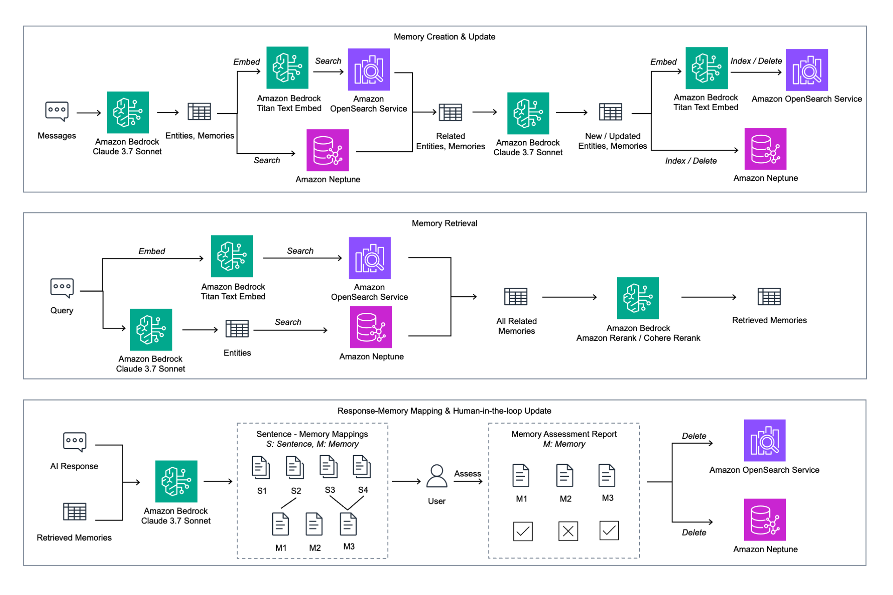

# Company-wise Memory in Bedrock

A graph memory system that uses knowledge graphs to capture, store, and retrieve contextual information from user conversations. The system extracts entities and relationships from conversations, stores them in Amazon Neptune graph database and Amazon OpenSearch with user isolation, and provides MCP (Model Context Protocol) integration for agent orchestration.

## Architect



## Features

- **Entity Extraction**: Automatically extracts entities and relationships from conversations using Amazon Bedrock
- **Graph Storage**: Stores knowledge graphs in Amazon Neptune with complete user isolation
- **Vector Search**: Hybrid search capabilities using Amazon OpenSearch for semantic similarity
- **Memory Management**: Intelligent memory operations including deduplication and conflict resolution
- **MCP Integration**: FastMCP server for seamless agent orchestration
- **Response-Memory Mapping**: Maps AI responses to supporting memories for transparency
- **Expiration Management**: Automatic cleanup of expired memories

## Requirements

- Python (only test on version 3.12, while it should also work on previous versions)
- AWS Account with access to:
  - Amazon Bedrock (Claude 3.7 Sonnet, Titan Embed, Cohere Rerank)
  - Amazon Neptune
  - Amazon OpenSearch Serverless

## Quick Start

### 1. AWS Infrastructure Setup

#### Create Amazon Neptune Cluster

1. Go to Amazon Neptune console
2. Create a new Neptune cluster
3. Note the cluster endpoint

#### Create Amazon OpenSearch Serverless Collection

1. Go to Amazon OpenSearch console
2. Create a serverless collection
3. Note the collection endpoint

### 2. Environment Setup

1. Clone (or Download) and navigate to the repository:

```bash
git clone https://github.com/aws-samples/sample-company-wise-memory-in-bedrock.git
cd sample-company-wise-memory-in-bedrock
```

2. Create Python environment:

```bash
conda create -n graph_mem python=3.12
conda activate graph_mem
pip install -r requirements.txt
```

3. Configure environment variables:

Copy `.env` file and update with your AWS endpoints:

```bash
cp .env.example .env
# Edit .env with your actual endpoints and settings
```

## Usage

### MCP Server

- Start the MCP Server

```bash
python src/mcp_interface.py
```

- Call MCP Server

```python
import asyncio
from fastmcp import FastMCP, Client
from fastmcp.client.transports import SSETransport

client = Client(SSETransport("http://127.0.0.1:8000/sse/"))


async def call_tool(user_id: str, query: str, top_k: int = 10):
    async with client:
        print(f"Connected: {client.is_connected()}")
        result = await client.call_tool("search_graph_memories", {"user_id": user_id, "query": query, "top_k": top_k})
        return result
result = asyncio.run(call_tool('86bd264a-9c60-4ce5-ba5d-a3734b51ae1b', 'Tell me what is Bedrock'))
print(result)
```

### More examples

- Memory Management

```python
from src.services.memory_management import MemoryManagementService

# Initialize service
memory_service = MemoryManagementService()

# Add memory from conversation
messages = [{"role": "user", "content": "I work at Amazon as a software engineer"}]
memory_service.add("user123", messages)

# Add memory with custom timestamp
memory_service.add("user123", messages, timestamp=1640995200)

# Search memories
query_messages = [{"role": "user", "content": "where do I work?"}]
memories = memory_service.search("user123", query_messages, top_k=5, hops=2)

# Delete memory
memory_service.delete("user123", "YOUR_MEMORY_ID")
```

- Response-Memory Mapping Generation (`test_mapping_gen.py`)

```python
from src.services.response_memory_mapping import ResponseMemoryMappingService

service = ResponseMemoryMappingService()

memories = [
    ("mem_001", "alert id TT-2024-0011 shows login attempts from a German IP"),
    ("mem_003", "John is supposed to be in NYC office"),
    ("mem_004", "John Smith is John"),
    ("mem_005", "Alert TT-2024-0011 is high severity"),
    ("mem_006", "Alert TT-2024-0011 is related to credential compromise"),
    ("mem_007", "John never traveled to Germany")
]

response = "Alert TT-2024-0011 shows suspicious login attempts from Germany while John should be in NYC. This is a high severity credential compromise incident."

print(f"Response: {response}")
print("\nMemories:")
for i, (mem_id, statement) in enumerate(memories):
    print(f"{i}: {mem_id} - {statement}")

mapping = service.generate_response_memory_mapping(response, memories)

print("\nMapping Result:")
for sentence, memories_info in mapping.items():
    print(f"Sentence: {sentence}")
    print("Supported by memories:")
    for memory_id, memory_statement in memories_info:
        print(f"  {memory_id}: {memory_statement}")
    print()

```

- Expired Memory Cleanup

```python
from src.services.memory_management import MemoryManagementService

memory_service = MemoryManagementService()

# Expiration period is configured in .env (MEMORY_DEFAULT_EXPIRATION_DAYS=30)

# Cleanup for specific user
deleted_count = memory_service.cleanup_expired_memories(user_id="user123")
print(f"Cleaned up {deleted_count} expired memories for user")

# # Cleanup expired memories for all users
# deleted_count = memory_service.cleanup_expired_memories()
# print(f"Cleaned up {deleted_count} expired memories")
```

- Data Cleanup

> \[!CAUTION\]
> This will delete all stored data in Neptune and Opensearch

```python
from src.utils.config import config
from src.utils.neptune_client import NeptuneClient
from src.utils.opensearch_client import OpenSearchClient

# Clear Neptune's Nodes and Edges
neptune = NeptuneClient(config.neptune)
neptune.cleanup()

# Clear OpenSearch indices and all data
opensearch = OpenSearchClient(config.opensearch)
opensearch.cleanup()
```

## API Reference

### MemoryManagementService

Main service class for memory operations:

```python
from src.services.memory_management import MemoryManagementService

service = MemoryManagementService()

# Add memories from conversation
service.add(user_id, messages, timestamp=None)

# Search memories (hybrid: graph + vector + rerank)
service.search(user_id, messages, top_k=10, hops=2)

# Delete specific memory
service.delete(user_id, memory_id)

# Cleanup expired memories
service.cleanup_expired_memories(user_id=None)
```

### ResponseMemoryMappingService

Service for mapping AI responses to supporting memories:

```python
from src.services.response_memory_mapping import ResponseMemoryMappingService

service = ResponseMemoryMappingService()

# Generate mapping between response sentences and source memories
mapping = service.generate_response_memory_mapping(response, memories)
# Returns: Dict[str, List[Tuple[str, str]]] - sentence -> [(memory_id, statement)]
```

**Methods:**

- `generate_response_memory_mapping(response, memories)`: Maps response sentences to supporting memories
  - `response`: AI response text to analyze
  - `memories`: List of (memory_id, statement) tuples
  - Returns: Dictionary mapping sentences to supporting memory tuples

### MCP Tools

Available MCP tools:

- `search_graph_memories(user_id, query, top_k=10)`: Search user's memories

### Core Models

```python
from src.models.core import Entity, Memory

# Entity represents extracted entities
@dataclass
class Entity:
    id: str
    user_id: str
    name: str
    type: str
    embedding: List[float]
    created_at: datetime

# Memory represents knowledge triplets
@dataclass
class Memory:
    id: str
    user_id: str
    statement: str
    subject_id: str
    subject_name: str
    predicate_name: str
    object_id: str
    object_name: str
    confidence: float
    source_message: str
    created_at: datetime
    expires_at: datetime
```

## Security

See [CONTRIBUTING](CONTRIBUTING.md#security-issue-notifications) for more information.

## License

This library is licensed under the MIT-0 License. See the LICENSE file.

